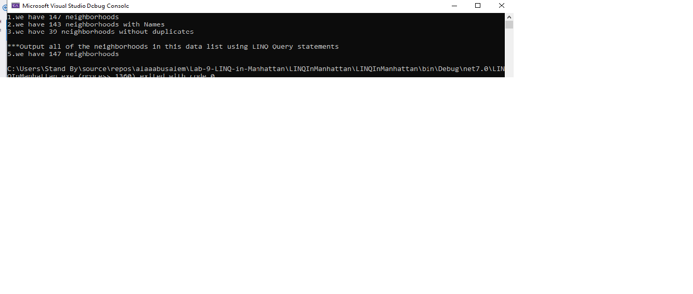

# Manhattan Neighborhoods 
My App contain a json file with data about Manhattan Neighborhoods thier names and coordinates etc.
I used the Linq and lamda expression
to find some information and show it in the console
 as shown in the picture

I created a Feacture,Geometry,Root classes 
and addedd the data.json file to the project
and used the I/O to read the file, then use  LINQ method
statment to return some data as requierd and I used one time Query statement
as required.

